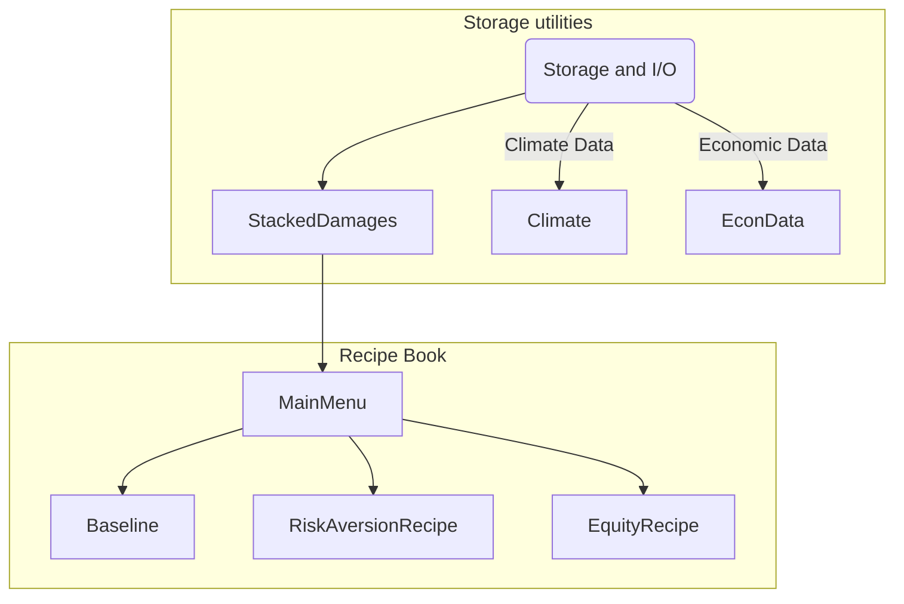

[](https://gitlab.com/ClimateImpactLab/Impacts/integration/-/commits/master)
[](https://climateimpactlab.gitlab.io/Impacts/integration/)
[](https://gitlab.com/ClimateImpactLab/Impacts/integration/-/commits/main)
[](https://github.com/psf/black)

# DSCIM: The Data-driven Spatial Climate Impact Model

This Python library enables the calculation of a sector integrated social cost of carbon
(SCC) using a variety of valuation methods and assumptions. The main purpose of this
library is to parse the monetized spatial damages from different sectors and integrate them
using different options (or menu options) that encompass different decisions, such as
discount levels, discount strategies, and different considerations related to
economic and climate uncertainty.

## Documentation

Full documentation is available here: https://climateimpactlab.gitlab.io/Impacts/integration/

## Setup

To begin we assume you have a system with `conda` available from the command line, and some familiarity with it. A conda distribution is available from [miniconda](https://docs.conda.io/en/latest/miniconda.html), [Anaconda](https://www.anaconda.com/), or [mamba](https://mamba.readthedocs.io/en/latest/). This helps to ensure required software packages are correctly compiled and installed, replicating the analysis environment.

Begin in the `dscim-epa` project directory. If needed this can be downloaded and unzipped, or cloned with `git`. For example

```bash
git clone https://github.com/ClimateImpactLab/dscim-epa.git
```

Next, setup a conda environment for this analysis. This replicates the software environment used for analysis. With `conda` from the command line this is

```bash
conda env create -f environment.yml
```

and then activate the environment with

```bash
conda activate dscim-epa
```

Be sure that all commands and analysis are run from this conda environment.

With the environment setup and active, the next step is to download required input data into the local directory. From the commandline run:

```bash
python damage_fun_runs/Directory_setup.py
```

Note that this will download several gigabytes of data and may take several minutes, depending on your connection speed.

## Running SCCs

After setting up your environment and the input data, you can run SCCs under different conditions with

```bash
python damage_fun_runs/command_line_scc.py
```

and follow the on-screen prompts.

## Structure and logic

The library is split into several components that implement the hierarchy
defined by the menu options. These are the main elements of the library and
serve as the main classes to call different menu options. In this release, only `Baseline` is available:



`StackedDamages` takes care of parsing all monetized damage data from several
sectors and read the data using a `dask.distributed.Client`. At the same time,
this class takes care of ingesting FaIR GMST and GMSL data needed to draw damage
functions and calculate FaIR marginal damages to an additional emission of
carbon. The data can be read using the following components: 

Class            | Function                                                                                                                                                                                                                                                                                                                                                                                           |
|------------------|----------------------------------------------------------------------------------------------------------------------------------------------------------------------------------------------------------------------------------------------------------------------------------------------------------------------------------------------------------------------------------------------------|
| `Climate`        | Wrapper class to read all things climate, including GMST and GMSL. You  can pass a `fair_path` with a NetCDF with FaIR control and pulse simulations and median FaIR runs. You can use `gmst_path` to input a  CSV file with model and year anomaly data, for fitting the damage functions. |
| `EconVars`       | Class to ingest sector path related data, this includes GDP and population data. Some intermediate variables are also included in this class, check the documentation for more details                                                                                                                                                                                                             |
| `StackedDamages` | Damages wrapper class. This class contains all the elements above and  additionally reads all the computed monetized damages. A single path is needed to read all damages, and sectors must be separated by folders.  If necessary, the class will save data in `.zarr` format to make chunking operations more efficient. Check documentation of the class for more details.                      |


and these elements can be used for the menu options: 
 - `Baseline`: Adding up all damages and collapse them to calculate a general SCC without valuing uncertainty.
 - `RiskAversionRecipe`: Add risk aversion certainty equivalent to consumption calculations - Value uncertainty over econometric and climate draws.
 - `EquityRecipe`: Add risk aversion and equity to the consumption calculations. Equity includes taking a certainty equivalent over spatial impact regions.


### Documentation and contributing

Learn more about how to contribute to the library checking our [contribution 
guidelines](./CONTRIBUTING.md) and the official [documentation][8].


## For Developers


### Contained environment
Additionally, we also have a built a contained environment compatible with most
HPC systems using Singularity. You can check more about how to use Singularity
using [its quick start guide][5]. In a nutshell, our Singularity container is
a Ubuntu OS with a Python (`miniconda3`) environment with all the needed
dependencies installed. We provide options to open jupyter notebooks that are
compatible with `Dask`. At the same time, you can build you own scripts and run
them against the same environment. 

**A note on singularity remote builts**: `singularity build` needs root access,
which might be impossible to have if you live under the HPC admin tyranny. But, 
Singularity have your back with the use of remote builds: `singularity build
--remote`. This means that the building process happens remotely on [Sylabs][6]
servers and gets automatically downloaded to the local machine. To make use of
this option, you need to authenticate and open a Sylabs account, you can start
this process by just doing: `singularity remote login`. A link will appear to
create an account and an API key. Later, an prompt will appear asking for your
API key, you just need to copy and paste it to your terminal.

You can build the container using our `Makefile`: 

```bash
make Makefile container
```

After running this you will have a `/images` directory with the container file.
This container will contain the same libraries that in the [pangeo environment][7] 
but the current version of the `dscim` will not be installed. In this
repo we added some tools to install the `dscim` and open a Jupyter
notebook to explore data or run SCC calculations.
`infrastructure/run_in_singularity.sh` is a script that installs this repo and
opens a Jupyter notebooks inside the container:

```bash
age: ${0} {build|notebook}
OPTIONS:
   -h|help             Show this message
   -b|--build
   -n|--notebook
INFRASTRUCTURE:
   Build the infrastructure and output python
   $ ./run_singularity.sh --build
   Run notebook inside Singularity image. This function takes arguments
   for both IP and port to use in Jupyterlab
   $ ./run_singularity.sh --notebook 0.0.0.0 8888
```

We have wrapped this process within the same `Makefile` we use to build the
Singularity container, so you can just do: 

```bash
make Makefile run-jupyter
```

The Jupyter `--port` option is hardcoded in the notebook, and the
auto-ssh-fowarding is active by using the `--ip` flag. Be aware that you do not
need to build the image on each run, the image will live in the `images/` folder
and you can use the `run-jupyter` to run the Jupyter Notebook. Also, everytime
you build the notebook, a fresh version of the code will be installed in the
notebook (this might take a while due to compilation issues). 

## Requirements

The library runs on Python +3.6 and it expects a that all requirements are
installed previous running any code, check Installation   The integration 
process is stacking different damage outcomes from several sectors 
at the impact region level. Thus, you will need several tricks to deal with 
the data I/O. 

## Computing

### Computing introduction

One of the tricks we rely on is the extensive use of `Dask` and `xarray` to
read raw damage data in `nc4` or `zarr` format (This latter is how coastal damages are provided). 
Hence, you will need to have a `Dask` `distributed.client` to harness the power of distributed computing. 
The computing requirements will vary depending on the execution of different 
menu options and the number of sectors you are aggregating. These are some general rules about 
computational intensity:

1. For recipes, `EquityRecipe > RiskAversionRecipe > BaselineRecipe`
2. For discounting, `euler_gwr > euler_ramsey > naive_gwr > naive_ramsey > constant > constant_model_collapsed`
3. More options (ie., greater number of SSPs, greater number of sectors) means more computing resources required.
4. `Dask` does not perfectly release memory after each menu run. Thus, if you are running
several menu options, in loops or otherwise, you may need to execute a `client.restart()` partway through
to force `Dask` into emptying memory.
5. Inclusion of coastal increases memory usage exponentially (due to the 500 batches and 10 GMSL bins against which
other sectors' damages must be broadcasted). Be careful and smart when running this option,
and don't be afraid to reconsider chunking for the files being read in.

### Setting up a Dask client

Ensure that the following packages are installed and updated:
[Dask](https://docs.dask.org/en/latest/install.html), [distributed](https://distributed.dask.org/en/latest/install.html), [Jupyter Dask extension](https://github.com/dask/dask-labextension), `dask_jobqueue`.

Ensure that your Jupyter Lab has add-ons enabled so that you can access Dask as an extension.

You have two options for setting up a Dask client.

#### Local client
<details><summary>Click to expand</summary>
If your local node has sufficient memory and computational power, you will only need to create a local Dask client.

_If you are operating on Midway3, you should be able to run the menu in its entirety.
Each `caslake` computing node on Midway3 has 193 GB memory, and 48 CPUs. This is sufficient for all options._

- Open the Dask tab on the left side of your Jupyter Lab page.
- Click `New + ` and wait for a cluster to appear.
- Drag and drop the cluster into your notebook and execute the cell. 
- You now have a new Dask client!
- click on the `CPU`, `Worker Memory`, and `Progress` tabs to track progress. You can arrange them in a side bar of your
Jupyter notebook to keep them all visible at the same time.
- note that opening 2 or 3 local Clients does _not_ get you 2 or 3 times the compute space. These clients will be sharing
the same node, so in fact computing may be slower as they are fighting for resources. (_check this, it's a hypothesis_)

</details>

#### Distributed client
<details><summary>Click to expand</summary>
If your local node does not have sufficient computational power, you will need to manually request separate
nodes with `dask.distributed`:
``` 
cluster = SLURMCluster()
print(cluster.job_script())
cluster.scale(10)
client = Client(cluster)
client
```
You can adjust the number of workers by changing the integer inside `cluster.scale()`. You can adjust the CPUs
and memory per worker inside `~/.config/dask/jobqueue.yaml`. 

To track progress of this client, copy-paste the "Dashboard" IP address and SSH into it. Example code:
```
ssh -N -f -L 8787:10.50.250.7:8510 user@midway3.rcc.uchicago.edu
```
Then go to `localhost:8787` in your browser to watch the magic.
</details>

### Dask troubleshooting

Most Dask issues in the menu come from one of two sources:
1. requesting Dask to compute too many tasks (your chunks are too small) which will result in a sort of "hung state"
and empty progress bar.
2. requesting Dask to compute too _large_ tasks (your chunks are too big). In this case, you will see memory under
`Worker Memory` taskbar shoot off the charts. Then your kernel will likely be killed by SLURM.

How can you avoid these situations?
1. Start with `client.restart()`. Sometimes, Dask does not properly release tasks from memory and this plugs up
the client. Doing a fresh restart (and perhaps a fresh restart of your notebook) will fix the problem.
2. Next, check your chunks! Ensure that any `xr.open_dataset()` or `xr.open_mfdataset()` commands have a `chunks`
argument passed. If not, Dask's default is to load the entire file into memory before rechunking later. This
is very bad news for impact-region-level damages, which are 10TB of data.
3. Start executing the menu object by object. Call an object, select a small slice of it, and add `.compute()`. If the object
computes successfully without overloading memory, it's not the memory leak. Keep moving through the menu until you find the
source of the error. _Hot tip: it's usually the initial reading-in of files where nasty things happen._ Check each object in the menu to 
ensure three things:
- chunks should be a reasonable size ('reasonable' is relative, but approximately 250-750 MB is typically successful
on a Midway3 `caslake` computing node)
- not too many chunks! Again, this is relative, but more than 10,000 likely means you should reconsider your chunksize.
- not too many tasks per chunk. Again, relative, but more than 300,000 tasks early in the menu is unusual and should be 
checked to make sure there aren't any unnecessary rechunking operations being forced upon the menu.
4. Consider rechunking your inputs. If your inputs are chunked in a manner that's orthogonal to your first few operations,
Dask will have a nasty time trying to rechunk all those files before executing things on them. Rechunking and resaving
usually takes a few minutes; rechunking in the middle of an operation can take hours.
5. If this has all been done and you are still getting large memory errors, it's possible that Dask isn't correctly separating
and applying operations to chunks. If this is the case, consider adding a `map_blocks` method, which explicitly
tells Dask to apply the operation to each chunk sequentially.

For more information about how to
execute `Dask` and the `job-queue` library (in case you are in a computing
cluster), refer to [Dask Distributed][3] and [job-queue][4] documentation.  
You can check several use-case examples on the computed notebook under examples.

### Priority

Maintaining priority is important when given tight deadlines to run menu options. To learn more about
priority, click [here](https://rcc.uchicago.edu/docs/tutorials/rcc-tips-and-tricks.html#priority
).

In general, following these hygiene rules will keep priority high:
1. Kill all notebooks/clusters when not in use.
2. Only request what you need (in terms of `WALLTIME`, `WORKERS`, and `WORKER MEMORY`).
3. Run things right the first time around. Your notebook text is worth an extra double check :) 

[3]: https://distributed.dask.org/en/latest/
[4]: https://jobqueue.dask.org/en/latest/
[5]: https://sylabs.io/guides/3.5/user-guide/quick_start.html
[6]: https://sylabs.io/
[7]: https://pangeo.io/setup_guides/hpc.html
[8]: https://climateimpactlab.gitlab.io/Impacts/integration/
