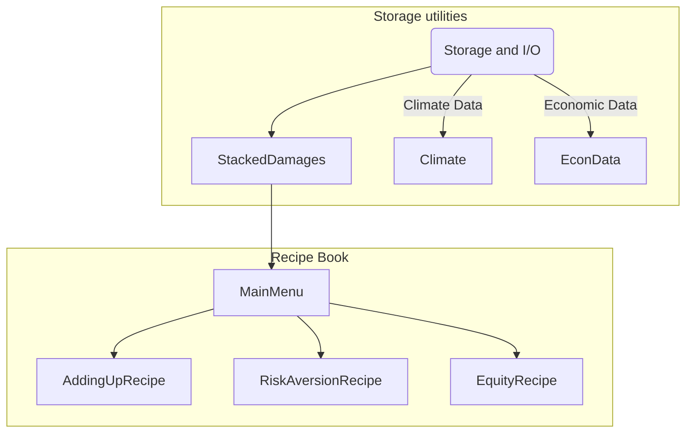

[](https://github.com/psf/black)

# DSCIM: The Data-driven Spatial Climate Impact Model

This Python library enables the calculation of sector-specific partial social cost of greenhouse gases (SC-GHG) and SCGHGs that are combined across sectors using a variety of valuation methods and assumptions. The main purpose of this
library is to parse the monetized spatial damages from different sectors and integrate them
using different options ("menu options") that encompass different decisions, such as
discount levels, discount strategies, and different considerations related to
economic and climate uncertainty.

## Setup

To begin we assume you have a system with `conda` available from the command line, and some familiarity with it. A conda distribution is available from [miniconda](https://docs.conda.io/en/latest/miniconda.html), [Anaconda](https://www.anaconda.com/), or [mamba](https://mamba.readthedocs.io/en/latest/). This helps to ensure required software packages are correctly compiled and installed, replicating the analysis environment.

Begin in the `dscim-epa` project directory. If needed this can be downloaded and unzipped, or cloned with `git`. For example

```bash
git clone https://github.com/ClimateImpactLab/dscim-epa.git
```

Next, setup a conda environment for this analysis. This replicates the software environment used for analysis. With `conda` from the command line this is

```bash
conda env create -f environment.yml
```

and then activate the environment with

```bash
conda activate dscim-epa
```

Be sure that all commands and analysis are run from this conda environment.

With the environment setup and active, the next step is to download required input data into the local directory. From the commandline run:

```bash
python scripts/directory_setup.py
```

Note that this will download several gigabytes of data and may take several minutes, depending on your connection speed.

## Running SCGHGs

After setting up your environment and the input data, you can run SCGHG calculations under different conditions with

```bash
python scripts/command_line_scghg.py
```

and follow the on-screen prompts. When the selector is a carrot, you may only select one option. Use the arrow keys on your keyboard to highlight your desired option and click enter to submit. When you are presented with `X` and `o` selectors, you may use the spacebar to select (`X`) or deselect (`o`) then click enter to submit once you have chosen your desired number of parameters. Once you have completed all of the options, the DSCIM run will begin.

### Command line options

Below is a short summary of what each command line option does. To view a more detailed description of what the run parameters do, see the [Documentation](https://impactlab.org/research/dscim-user-manual-version-092022-epa) for Data-driven Spatial Climate Impact Model (DSCIM). 

#### Sector

The user may only select one sector per run. Sectors represent the combined SCGHG or partial SCGHGs of the chosen sector.

#### Discount rate

These runs use endogenous Ramsey discounting that are targeted to begin at the chosen near-term discount rate(s). 

#### Pulse years

Pulse year represents the SCGHG for a pulse of greenhouse gas (GHG) emitted in the chosen pulse year(s). 

#### Domain of damages

The default is a global SCGHG accounting for global damages in response to a pulse of GHG. The user has the option to instead compute a domestic SCGHG accounting only for United States damages.

#### Optional files

By default, the script will produce the expected SCGHGs as a `.csv`. The user also has the option to save the full distribution of SCGHGs -- across emissions, socioeconomics, and climate uncertainty -- as a `.csv`, and the option to save global consumption net of baseline climate damages ("global_consumption_no_pulse") as a netcdf `.nc4` file.


## Structure and logic

The library is split into several components that implement the hierarchy
defined by the menu options. These are the main elements of the library and
serve as the main classes to call different menu options.



`StackedDamages` takes care of parsing all monetized damage data from several
sectors and read the data using a `dask.distributed.Client`. At the same time,
this class takes care of ingesting FaIR GMST and GMSL data needed to draw damage
functions and calculate FaIR marginal damages to an additional emission of
carbon. The data can be read using the following components: 

Class            | Function                                                                                                                                                                                                                                                                                                                                                                                           |
|------------------|----------------------------------------------------------------------------------------------------------------------------------------------------------------------------------------------------------------------------------------------------------------------------------------------------------------------------------------------------------------------------------------------------|
| `Climate`        | Wrapper class to read all things climate, including GMST and GMSL. You  can pass a `fair_path` with a NetCDF with FaIR control and pulse simulations and median FaIR runs. You can use `gmst_path` to input a  CSV file with model and year anomaly data, for fitting the damage functions. |
| `EconVars`       | Class to ingest sector path related data, this includes GDP and population data. Some intermediate variables are also included in this class, check the documentation for more details                                                                                                                                                                                                             |
| `StackedDamages` | Damages wrapper class. This class contains all the elements above and  additionally reads all the computed monetized damages. A single path is needed to read all damages, and sectors must be separated by folders.  If necessary, the class will save data in `.zarr` format to make chunking operations more efficient. Check documentation of the class for more details.                      |


and these elements can be used for the menu options: 
 - `AddingUpRecipe`: Adding up all damages and collapse them to calculate a general SCC without valuing uncertainty.
 - `RiskAversionRecipe`: Add risk aversion certainty equivalent to consumption calculations - Value uncertainty over econometric and climate draws.
 - `EquityRecipe`: Add risk aversion and equity to the consumption calculations. Equity includes taking a certainty equivalent over spatial impact regions.

